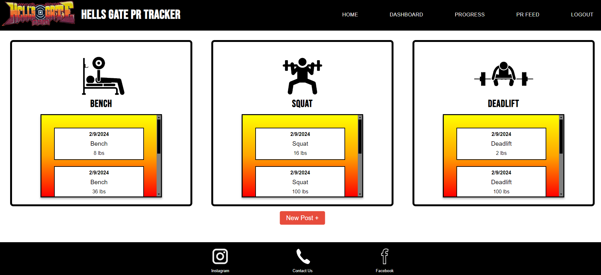

# Hells-Gate-PR


## Description

This is a full stack web application designed to help gym goers compare PRs in a variety of 3 different power lifts, allowing a user to take
their gym goals to new heights and test their strength against fellow gym goers.

The application allows user signup and login functionality to then gain access to the gym's Homepage, a Dashboard of your personal lift
records and the ability to add more, a Progress page with a chart per lift type to show your PR's over time, and a PR Feed with all lift
posts from fellow gym goers and yourself!

The project follows the MVC Paradigm in its structure. Technologies used to create this application include Node.js, Express.js and its
packages for authentication, MySQL, Sequelize as the ORM, Handlebars as the template language, and Chart.js as our new technology!

## Table of Contents

-  [User Story](#user-story)
-  [Acceptance Criteria](#acceptance-criteria)
-  [Output Example](#output-example)
-  [Deployment](#deployment)
-  [License](#license)
-  [Contributing](#contributing)
-  [Questions](#questions)

## User Story

```
- AS AN avid gym goer with serious PR lift goals
- I WANT an accessible and easy to navigate website
- SO THAT I can track and share those PRs!
```

## Acceptance Criteria

```
GIVEN A Gym/PR tracking webpage
- WHEN on load
- THEN it logs into webpage
- WHEN on user login
- THEN take you to home feed
- IF there are existing posts
- THEN they will show on the home feed
- WHEN I check the Nav bar
- THEN it will have Home feed, personal dashboard where you make posts, and log out option
- WHEN you click dashboard
- THEN you’re taken to dashboard
- WHEN in Dashboard
- THEN it has a button that says “NEW PR”
- WHEN On click
- THEN it opens a form page
- WHEN on the Form
- THEN the form takes in dropdown of lift, text box for weight,and post button
- WHEN you "click" Post button
- THEN it creates a POST request to create the new PR post
- WHEN the new PR post is created
- THEN it is sent to your dashboard and the home feed simultaneously
```

## Output Example

-  

-  

-  

-  

-  

-  

## Deployment

[Deployed URL on Heroku](https://secret-spire-07174-9e0cafb948bb.herokuapp.com/)

[Hells-Gate-PR Repository](https://github.com/camillebagnani/Hells-Gate-PR)

## License

Copyright (c) 2024 Camille Bagnani. All rights reserved.

Licensed under the [MIT License](https://choosealicense.com/licenses/mit).

## Contributing

Dane Larsen (https://github.com/DaneLarsen1)

Camille Bagnani (https://github.com/camillebagnani)

Tony Pinski (https://github.com/Verred01)

Paul Orozco (https://github.com/Paul6git)

Ruthie Pina (https://github.com/ruthiepina)

## Questions

Hells Gate Pr created by Dane Larsen, Camille Bagnani, Tony Pinski, Paul Orozco, and Ruthie Pina.

For any additional questions or comments, please send an email to the repo creator [Camille Bagnani](https://github.com/camillebagnani) at
<camillebagnani@gmail.com>.
